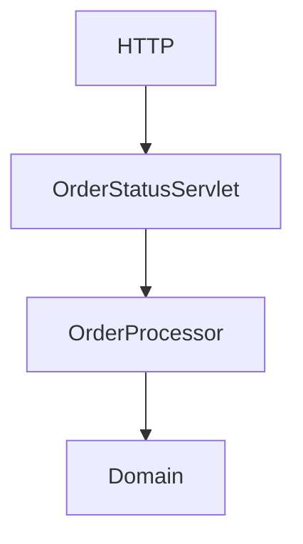

0.9f.1 — Understand the HTTP adapter boundary
0.9f.2 — Add Jakarta Servlet API
0.9f.3 — Create the status endpoint
0.9f.4 — Connect it to OrderProcessor
0.9f.5 — Start Liberty
0.9f.6 — Test with curl
0.9f.7 — Debug request flow in IntelliJ
0.9f.8 — Git checkpoint

0.9f.1 — The HTTP Adapter Boundary
Our current application looks like:

com.jmxlab
│
├── domain
│   └── order
│       └── Order
│
└── application
    └── order
        └── OrderProcessor

We are going to add 
`
com.jmxlab.infrastructure
└── http
    └── OrderStatusServlet
`

So the communication would be like below
                    HTTP
                    │
                    ▼
                    OrderStatusServlet
                    │
                    ▼
                    OrderProcessor
                    │
                    ▼
                    Domain

We are not putting http logic within OrderProcessor because we do not want to create tight coupling to web runtime. 

0.9f.2 — Add the Servlet API
Add servlet dependency in application/pom.xml, as we are using Jakarta Servlet API, we would be adding below dependency.
`
<dependency>
    <groupId>jakarta.servlet</groupId>
    <artifactId>jakarta.servlet-api</artifactId>
    <version>6.1.0</version>
    <scope>provided</scope>
</dependency>
`
Notice that we have added provided scope for servlet api because it will be available at runtime by open liberty.

0.9f.3 — Create the Servlet
Create new package under com.jmxlab.infrastructure.http
Create new file OrderStatusServlet.java
In this section, we are deliberately building a temporary, tight coupling where our servlet manually creates the OrderProcessor using the new keyword. This baseline helps us understand the problem before we introduce CDI and proper dependency injection in the next step. For now, please do not 'improve' this code with Spring, singletons, or other frameworks—stick to this manual setup so you can see the architecture evolve incrementally

0.9f.6 — Build
Stop Liberty if it's running.
Then from the project root:
`
mvn clean build
`
Build should be successful 

0.9f.7 — Start Liberty
Go to application folder, run below command 
`
mvn liberty:dev
`